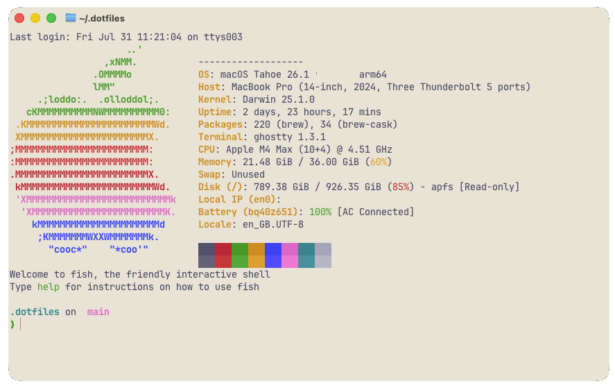

# dotfiles

`b-d-e`'s dotfiles



### Pre-Requisites

Installed:
- `zsh` shell
- `homebrew` 
- `github` creds setup

### Installation

```bash
git clone --recursive git@github.com:b-d-e/dotfiles.git ~/.dotfiles
cd .dotfiles && sh bootstrap.sh
```

You may be asked to enter your password several times.

The `--recursive` clone pulls in the [`CLAUDE.md`](https://github.com/b-d-e/CLAUDE.md)
submodule (global Claude Code memory), which `symlinks.sh` links to
`~/.claude/CLAUDE.md`.

### Shells

`fish` is the default login shell (bootstrap runs `chsh`). `zsh` and `nushell`
are installed and configured too — `zsh`'s config is kept as a fallback
(`chsh -s "$(command -v zsh)"`); try `nushell` by just typing `nu`.

All three share the [starship](https://starship.rs) prompt (`starship.toml`)
and, where supported, [atuin](https://atuin.sh) history. The prompt needs a
Nerd Font — `font-jetbrains-mono-nerd-font` (Brewfile on macOS; auto-downloaded
on Linux) — which the tracked `ghostty/config` selects for the terminal.

- `fastfetch` shows a system-info banner on new shells (`fastfetch/config.jsonc`).

**Theme:** Catppuccin, auto day/night. `ghostty` follows the macOS light/dark
appearance (`Latte` ⇄ `Mocha`, with a softened light background — see
`ghostty/themes/Catppuccin Latte Soft`); `eza` and `starship` draw with the terminal's
ANSI palette so they follow along; `bat` matches via `bat/config`
(`--theme=auto:system`).

### CLI stack

Shared across all three shells (installed via the Brewfiles):

- [`zoxide`](https://github.com/ajeetdsouza/zoxide) — smarter `cd` (`z` / `zi`)
- [`eza`](https://github.com/eza-community/eza) — modern `ls` (`ls`/`ll`/`la`/`lt`, with icons + git status)
- [`bat`](https://github.com/sharkdp/bat) — `cat` with syntax highlighting
- [`ripgrep`](https://github.com/BurntSushi/ripgrep) — fast recursive search (`rg`)
- [`fzf`](https://github.com/junegunn/fzf) — fuzzy finder: `Ctrl-R` history, `Ctrl-T` files, `Alt-C` cd (also backs zoxide's `zi`)
- [`fd`](https://github.com/sharkdp/fd) — fast, friendly `find`

